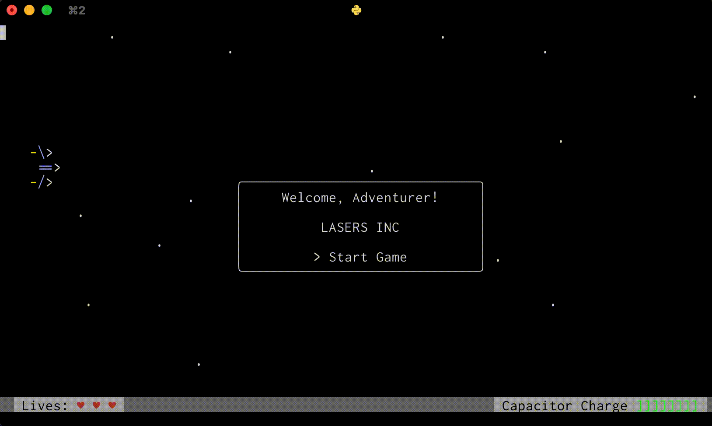

# Lasers, Inc.
A game for Vim, because why should Emacs have all the fun?

I was in the mood to play a game in my terminal the other day, only to realize
that all the fun games are inside Emacs. This project attempts to remedy this
horrific situation.



## Setup and usage
 - Dependencies:
   - `python3`
   - `pip3` packages: `pynvim`, `pygame`, `pyfxr`
 - Clone this repo, `cd` into it, and then run:
```
nvim -u LasersInc.nvim -c 'nnoremap <C-c> :qa!<CR>'
```
Press Ctrl-C to exit.

 - Edit `rplugin/python3/LasersInc.py` and change the `TARGET_FPS` to get a
   different framerate. The actual framerate will be lower (adjusting for this
   is on my to-do list).
   - The game area's width and height can also be changed.

## Controls

Controls can be configured in `/data/game_controls.properties`. By default, the
ship is controlled via <kbd>h</kbd><kbd>j</kbd><kbd>k</kbd><kbd>l</kbd>.
<kbd>Space</kbd> triggers the main cannon and <kbd>O</kbd> and <kbd>o</kbd>
toggle the top and bottom lasers, respectively.

 - Because the game uses vim keyboard inputs, multiple control keys cannot be
   held down at the same time. Holding down a single key will simply repeat it
   at the rate of your OS key repeat setting. Just mash the same directional
   key frantically to accelerate the spaceship reliably. Holding down the
   spacebar would make sense, though.

## Development status

This project is basically in MVP/alpha stage. There's currently sort of an
infinite-survival challenge you can play, but the game needs some new enemies,
some levels and a game lifecycle (death, gameover, etc.). My end goal is to
implement network multiplayer once the game system is more stable.

I originally envisioned a full-scale story mode, perhaps involving a
corporation that sells lasers. There's probably also room for some vim-based
humor and 4th-wall breaking.

